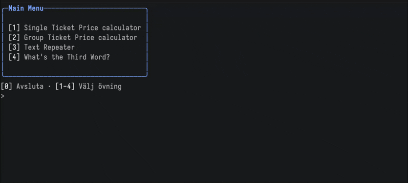
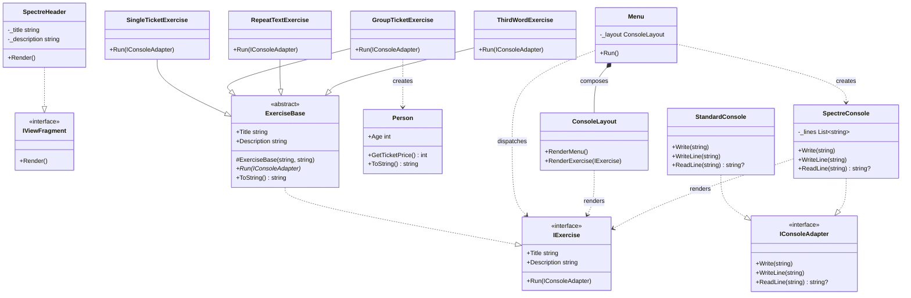

# Flow Control Exercises — OOP Refactor

A C# console application built as part of the Lexicon .NET course. The project refactors a set of beginner flow-control exercises into a structured OOP design with a two-panel Spectre.Console UI.

## Exercises

| # | Title | Description |
|---|-------|-------------|
| 1 | Single Ticket Price calculator | Calculates ticket price based on age |
| 2 | Group Ticket Price calculator | Calculates total price for a group |
| 3 | Text Repeater | Repeats input text 10 times |
| 4 | What's the Third Word? | Extracts the third word from a sentence |

## Architecture

The refactor introduces a small set of interfaces that decouple presentation from logic:

`SpectreConsole` implements `IConsoleAdapter` and renders all exercise I/O live inside the right panel, re-drawing on every write or read. `StandardConsole` is a plain pass-through wrapper around `System.Console` used for testing without the UI.

The composition root (`Program.cs`) wires the exercise list and passes it to `Menu`, which owns the run loop. `ConsoleLayout` handles the static menu and exercise description views using Spectre.Console panels.

## Tech

- .NET 10 · C# 12
- [Spectre.Console](https://spectreconsole.net/) 0.55 — panels, markup, tables
