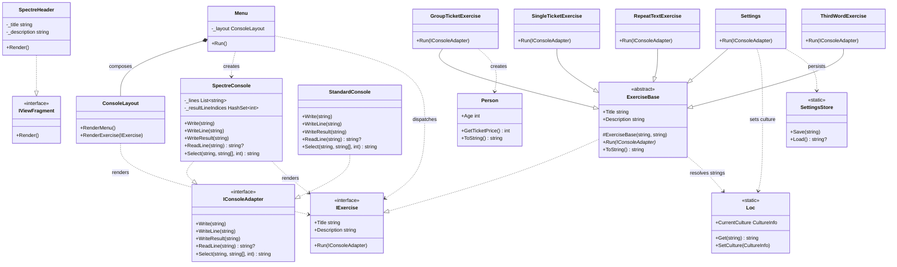

# Flow Control Exercises — OOP Refactor

A C# console application built as part of the Lexicon .NET course. The project refactors a set of beginner flow-control exercises into a structured OOP design with a two-panel Spectre.Console UI and full multi-language support (English, Swedish, Greek, Hungarian).

## Exercises

| # | Title | Description |
|---|-------|-------------|
| 1 | Single Ticket Price | Calculates ticket price based on age |
| 2 | Group Ticket Price | Calculates total price for a group with mixed ages |
| 3 | Text Repeater | Repeats input text 10 times, comma-separated |
| 4 | What's the Third Word? | Extracts the third word from a sentence |
| 5 | Settings | Select UI language (English / Swedish / Greek / Hungarian) |

## Architecture

The refactor introduces a small set of interfaces that decouple presentation from logic:

`SpectreConsole` implements `IConsoleAdapter` and renders all exercise I/O live inside the right panel, re-drawing on every write or read. `WriteResult` marks lines as final answers and renders them in bold yellow. `Select` drives the arrow-key language picker directly inside the panel. `StandardConsole` is a plain pass-through wrapper around `System.Console`.

The composition root (`Program.cs`) wires the exercise list and passes it to `Menu`, which owns the run loop. `ConsoleLayout` handles the static menu and exercise description views using Spectre.Console panels.

Localisation is handled by a static `Loc` class backed by `.resx` resource files for each locale. `ExerciseBase` stores resource keys rather than strings, so `Title` and `Description` resolve live on every read — language switches take effect immediately without restarting. `SettingsStore` persists the selected locale tag to `settings.json` alongside the binary.

## Tech

- .NET 10 · C# 12
- [Spectre.Console](https://spectreconsole.net/) 0.55 — panels, markup, tables
- `.resx` resource files — localisation for EN / SV / EL / HU
- `System.Text.Json` — settings persistence
